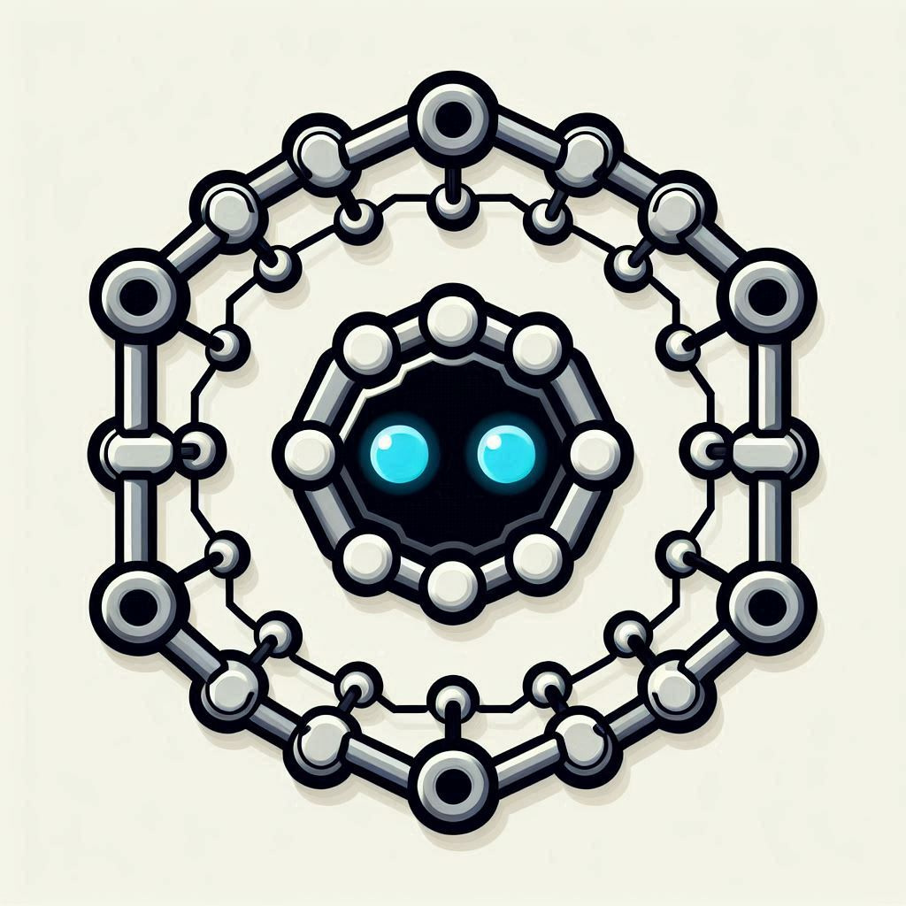

# Chain Agentic Customer Bot

<div align="center">

</div>

### ```Providing agentic 🤖 solutions to blockchain ⛓️🛡️🔗 economy💰📈!```


## About Chain Agentic
Chain Agentic is a new blockchain startup harnessing the power of google gemini to create intelligent AI agents capable of providing dynamic and intelligent data response based on the given blockchain project.

## Chain Agentic Customer Bot

This is a customer service bot built using telegram api and rust programming language.
It utilizes the power of google gemini, combined with well structured role prompt and information to respond to potentical clients to generate lead.


## Demo 
[**Demo Video**](https://youtu.be/Fn0CQMwphKc?si=GCM2BUUHUPyMZjtY)

[**Project**](https://t.me/chainagentic_bot)

# How to Test Project Locally

``` git  clone ```

change directory to chain_agentic git folder

``` cd chain_agentic```

### Create a .env file in the repo and input the the following 

```
TELEGRAM_BOT_TOKEN="Insert A telegram bot token"

GEMINI_API_KEY="Insert google cloud gemini key"

```


## Running The Application 
simply go to your terminal and write the following code

``` cargo build```
 
``` cargo run```

Go to the used telegram bot to token and test the application.


